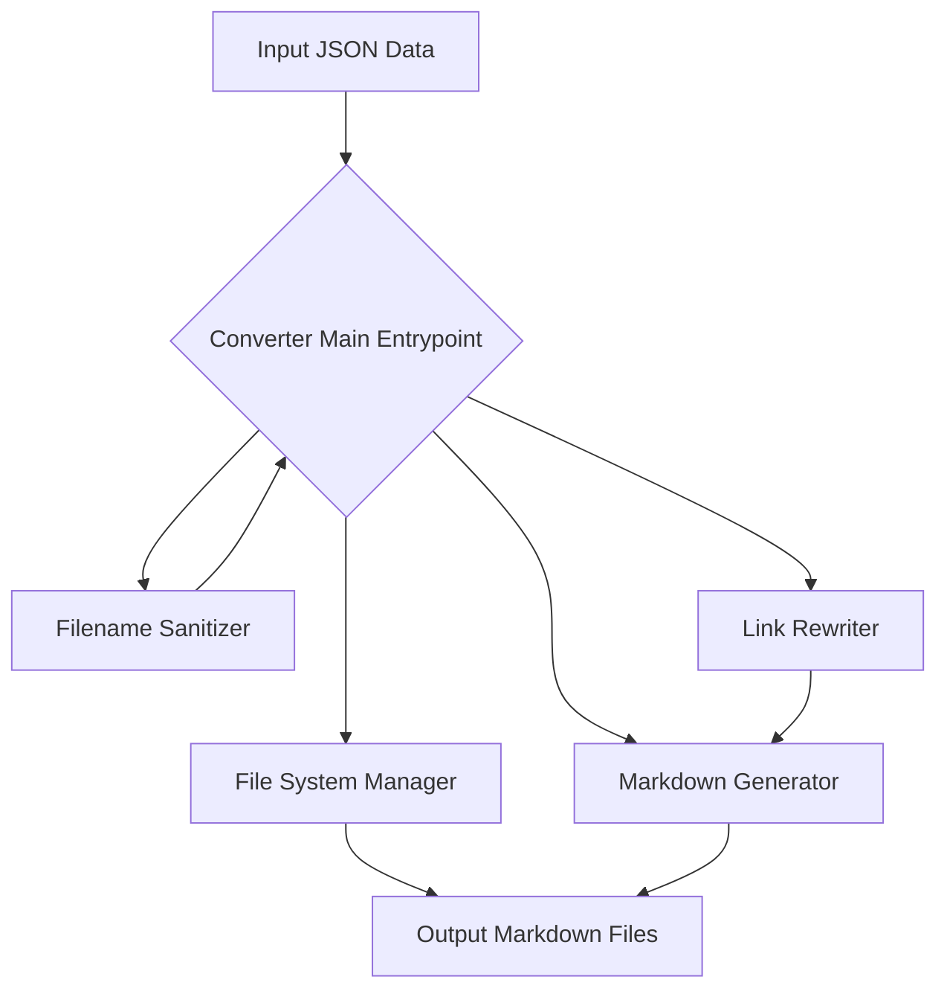
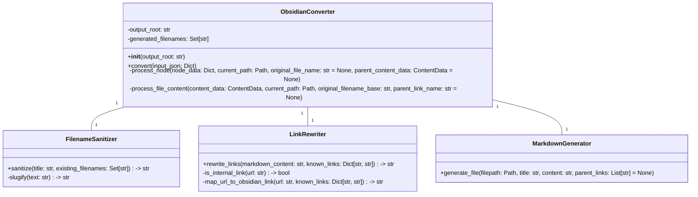
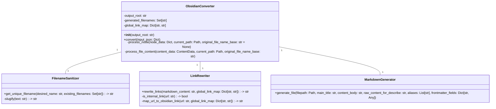

# Python 包开发设计文档：Obsidian Knowledge Converter

## 1. 引言

### 1.1 项目概述

本项目旨在开发一个 Python 包，用于将 `KnowledgeIngestor` 库生成的结构化 JSON 数据（包含文件系统层级和文件内部标题层级）转换为一系列符合 Obsidian 双向链接语法的 Markdown 文件。核心目标是将文档内部的逻辑结构（各级标题）“原子化”为独立的 Markdown 文件，并通过双链关联，从而构建一个高度互联、粒度更细的知识网络，便于在 Obsidian 中进行管理和探索。

### 1.2 目标受众

本设计文档面向 Python 开发者，旨在清晰地阐述包的设计理念、核心算法和模块结构，以便于实现和后续维护。

### 1.3 核心转换理念

*   **文件系统层级映射**：JSON 中的 `folder` 结构直接映射为文件系统目录。
*   **文档内部标题原子化**：每个 `level > 1` 的标题及其内容（直到下一个同级或更高级标题出现前）被视为一个独立的知识单元，并生成为一个独立的 `.md` 文件。
*   **链接驱动**：利用 Obsidian 的 `[[链接]]` 语法，在原子化后的文件之间建立父子、兄弟（可选）以及引用的关联。
*   **健壮的文件命名**：处理文件名特殊字符和命名冲突。

## 2. 输入与输出

### 2.1 输入数据结构

输入为一个 Python 字典，结构与 `KnowledgeIngestor` 的输出一致。
**示例输入 (简化版，基于之前提供的完整示例):**

```python
# input_data.py
EXAMPLE_INPUT_JSON = {
    "name": "optimizing",
    "type": "folder",
    "children": [
        {
            "name": "advanced_retrieval",
            "type": "folder",
            "children": [
                {
                    "name": "advanced_retrieval.md",
                    "type": "file",
                    "content": {
                        "title": "Advanced Retrieval Strategies",
                        "level": 1,
                        "content": "Some top-level content for adv_retrieval.md.",
                        "children": [
                            {
                                "title": "Main Advanced Retrieval Strategies",
                                "level": 2,
                                "content": "Details on main strategies.",
                                "children": []
                            },
                            {
                                "title": "Query Transformations",
                                "level": 2,
                                "content": "Info about query transformations. See [Query Transformations Docs](../../optimizing/advanced_retrieval/query_transformations.md).",
                                "children": []
                            }
                        ]
                    }
                },
                {
                    "name": "query_transformations.md",
                    "type": "file",
                    "content": {
                        "title": "Query Transformations",
                        "level": 1,
                        "content": "LlamaIndex allows you to perform _query transformations_...",
                        "children": [
                            {
                                "title": "Use Cases",
                                "level": 4, # 注意这里的level是4
                                "content": "Query transformations have multiple use cases...",
                                "children": []
                            },
                            {
                                "title": "HyDE (Hypothetical Document Embeddings)",
                                "level": 3,
                                "content": "[HyDE](http://example.com/hyde.pdf) is a technique...",
                                "children": []
                            }
                        ]
                    }
                }
            ]
        }
    ]
}
```

### 2.2 输出文件结构与内容规范

输出将是一个包含 Markdown 文件的目录树。

**输出示例 (对应上述输入，假设输出目录为 `output_vault`):**

```
output_vault/
├── optimizing/
│   └── advanced_retrieval/
│       ├── advanced_retrieval.md
│       ├── advanced_retrieval - Main Advanced Retrieval Strategies.md
│       ├── advanced_retrieval - Query Transformations.md
│       ├── query_transformations.md
│       ├── query_transformations - Use Cases.md
│       └── query_transformations - HyDE (Hypothetical Document Embeddings).md
```

**单个输出文件内容示例 (`output_vault/optimizing/advanced_retrieval/query_transformations - Use Cases.md`):**

```markdown
# Use Cases

Query transformations have multiple use cases...

---
*Parent File:* [[query_transformations]]
*Parent Section:* [[query_transformations - Query Transformations]]
```

**单个输出文件内容示例 (`output_vault/optimizing/advanced_retrieval/advanced_retrieval - Query Transformations.md`):**

```markdown
# Query Transformations

Info about query transformations. See [[query_transformations]].

---
*Parent File:* [[advanced_retrieval]]
*Parent Section:* [[advanced_retrieval - Advanced Retrieval Strategies]]
```

## 3. 核心设计与模块划分

### 3.1 模块概览



### 3.2 关键数据结构 (Internal)

为了方便处理和传递信息，可以定义一些内部数据类或字典结构。

#### `ProcessedNode`

表示一个 JSON 节点（文件夹或文件）的内部处理状态。

```python
class ProcessedNode:
    def __init__(self, name, type, relative_path, children=None, content_data=None):
        self.name = name # Original name (e.g., "my_folder", "my_file.md")
        self.type = type # "folder" or "file"
        self.relative_path = relative_path # Path from root (e.g., "optimizing/advanced_retrieval")
        self.children = children if children is not None else [] # List of ProcessedNode
        self.content_data = content_data # Only for type="file", a ContentData object
        # self.output_filepath = None # Absolute path to the main file generated for this node
```

#### `ContentData`

表示一个文件或内部标题块的内容。

```python
class ContentData:
    def __init__(self, title, level, content, children=None, original_filename=None, parent_title=None):
        self.title = title # Cleaned title string
        self.level = level # Heading level (1 for main file, 2+ for sections)
        self.content = content # Raw Markdown content for this section
        self.children = children if children is not None else [] # List of ContentData for sub-sections
        self.original_filename = original_filename # e.g., "advanced_retrieval.md"
        self.parent_title = parent_title # Title of the immediate parent section/file
        # self.output_filename_slug = None # Slugified filename for this section's file
        # self.obsidian_link_name = None # Name to use in Obsidian link (e.g., "My Title")
```

### 3.3 核心类与方法设计

#### `ObsidianConverter` (主入口类)

*   **职责**: 协调整个转换过程，管理全局状态（如已生成的文件名集合用于去重）。
*   **方法**:
    *   `__init__(self, output_root: str)`: 初始化转换器，指定输出根目录。
    *   `convert(self, input_json: Dict) -> None`: 接收 `KnowledgeIngestor` 的 JSON 输出，启动转换。



#### `FilenameSanitizer`

*   **职责**: 将任意字符串转换为合法且唯一的 Obsidian 文件名。
*   **方法**:
    *   `slugify(text: str) -> str`: 核心方法，去除特殊字符，转换为小写，替换空格等。
    *   `sanitize(title: str, existing_filenames: Set[str]) -> str`: 结合 `slugify` 并处理文件名冲突（添加 `_1` 后缀）。

#### `LinkRewriter`

*   **职责**: 解析 Markdown 内容，将识别到的内部相对路径链接转换为 Obsidian 双链。
*   **方法**:
    *   `rewrite_links(markdown_content: str, known_links: Dict[str, str]) -> str`: 接收 Markdown 文本和一个“已知链接映射表”（`原始文件名/路径` -> `Obsidian链接名`），返回重写后的 Markdown。

#### `MarkdownGenerator`

*   **职责**: 将处理后的内容写入到实际的 Markdown 文件中。
*   **方法**:
    *   `generate_file(filepath: Path, title: str, content: str, parent_links: List[str] = None)`: 根据给定路径、标题、内容和父级链接列表生成 `.md` 文件。

### 3.4 核心转换流程 (伪代码 / 详细步骤)

```mermaid
graph TD
    A[Start Conversion (input_json, output_root)] --> B{Initialize Converter};
    B --> C{Process Root Node (input_json)};

    subgraph ProcessNode(Recursive Function: process_node(node, current_path, original_file_name, parent_content_data))
        C --> D{Is node a 'folder'?};
        D -- Yes --> E[Create Folder if not exists];
        E --> F[For each child in folder.children: Call process_node(child, new_path)];
        D -- No --> G{Is node a 'file'?};
        G -- Yes --> H[Extract content_data from file.content];
        H --> I[Generate Main File for this 'file' node];
        I --> J{Process content_data.children};
        J --> K[For each child_content in content_data.children: Call process_file_content(child_content, current_path, original_file_name_base, this_node's_link_name)];
        K --> L[Return];
    end

    subgraph ProcessFileContent(Recursive Function: process_file_content(content_data, current_path, original_filename_base, parent_link_name))
        K --> M[Sanitize content_data.title to get obsidian_link_name and slug_filename];
        M --> N[Generate new file path: current_path / slug_filename.md];
        N --> O[Construct file content: H1 title, content_data.content, Parent links];
        O --> P[Rewrite links in content_data.content using LinkRewriter];
        P --> Q[Write file using MarkdownGenerator];
        Q --> R{For each child_content in content_data.children: Call process_file_content(child_content, current_path, original_filename_base, obsidian_link_name)};
        R --> S[Return];
    end
```

**详细步骤说明:**

1.  **`ObsidianConverter.convert(input_json)`**:
    *   初始化 `generated_filenames` 集合。
    *   调用 `_process_node(input_json, Path(self.output_root))`。

2.  **`_process_node(node_data, current_path, original_file_name=None, parent_content_data=None)`**:
    *   **如果是 `folder` 类型**:
        *   创建新的 `folder_path = current_path / node_data['name']`。
        *   如果 `folder_path` 不存在，则创建目录。
        *   递归调用 `_process_node` 处理 `node_data['children']` 中的每个子节点，传递 `folder_path` 作为新的 `current_path`。
    *   **如果是 `file` 类型**:
        *   `original_file_name_base = Path(node_data['name']).stem` (例如 `advanced_retrieval`)。
        *   **处理主文件**:
            *   `main_file_title = node_data['content']['title']`
            *   `main_file_link_name = FilenameSanitizer.sanitize(main_file_title, self.generated_filenames)` (直接使用标题作为链接名，因为这是主文件)
            *   `main_file_path = current_path / f"{main_file_link_name}.md"`
            *   构建主文件内容：`main_file_content = node_data['content']['content']`
            *   **添加子标题链接到主文件**: 遍历 `node_data['content']['children']`，对每个子标题 `child_content`，生成其预期的 Obsidian 链接名（例如 `[[original_file_name_base - Child Title]]`），并将其添加到 `main_file_content` 的末尾（或专门的“相关章节”区域）。
            *   使用 `MarkdownGenerator.generate_file(main_file_path, main_file_title, main_file_content)` 写入。
        *   **递归处理文件内部的子标题**:
            *   对于 `node_data['content']['children']` 中的每个 `child_content_data`：
                *   调用 `_process_file_content(child_content_data, current_path, original_file_name_base, main_file_link_name)`。

3.  **`_process_file_content(content_data, current_path, original_filename_base, parent_link_name)`**:
    *   **生成当前标题的 Obsidian 链接名和文件名**:
        *   `suggested_filename = f"{original_filename_base} - {content_data.title}"`
        *   `obsidian_link_name = FilenameSanitizer.sanitize(suggested_filename, self.generated_filenames)`
        *   `output_file_path = current_path / f"{obsidian_link_name}.md"`
    *   **构建文件内容**:
        *   `file_content = f"# {content_data.title}\n\n{content_data.content}`
        *   **重写内部链接**: `file_content = LinkRewriter.rewrite_links(file_content, { ... })`
            *   `LinkRewriter` 需要一个映射表：`{原始路径/文件名: Obsidian链接名}`。这个映射表需要在整个转换过程中动态构建和传递。
            *   例如，`../../optimizing/advanced_retrieval/query_transformations.md` 应该被映射为 `[[query_transformations]]`。
        *   **添加父级链接**:
            *   `parent_links = [f"*Parent File:* [[{original_filename_base}]]", f"*Parent Section:* [[{parent_link_name}]]"]`
            *   将这些链接添加到 `file_content` 末尾。
    *   使用 `MarkdownGenerator.generate_file(output_file_path, content_data.title, file_content, parent_links)` 写入文件。
    *   **递归处理子标题**:
        *   对于 `content_data['children']` 中的每个 `grandchild_content_data`：
            *   调用 `_process_file_content(grandchild_content_data, current_path, original_filename_base, obsidian_link_name)`。

## 4. 异常处理与边缘情况

*   **文件名特殊字符**: `FilenameSanitizer` 模块负责处理。
*   **文件名冲突**: `FilenameSanitizer` 模块负责添加 `_1` 等后缀。
*   **空内容**: 如果 `content` 字段为空，则生成的文件内容为空，但标题和链接仍会生成。
*   **JSON 结构不完整/异常**: 输入验证（可选），或在解析时使用 `try-except` 捕获 `KeyError` 等。
*   **相对路径链接解析**: `LinkRewriter` 需要智能判断链接是否指向本项目内部生成的其他文件，并将其转换为双链。这可能需要维护一个全局的“原始路径到 Obsidian 链接名”的映射表。

## 5. 待定/讨论点

*   **链接映射表的构建与传递**: `LinkRewriter` 如何获取所有可能的目标文件及其对应的 Obsidian 链接名？可能需要在 `ObsidianConverter` 层面维护一个全局的 `original_path_to_obsidian_link_map: Dict[str, str]`。在每次生成新的 `.md` 文件时，将 `original_file_path` 和 `obsidian_link_name` 加入此映射。
*   **父级链接的格式和内容**: 目前示例是 `*Parent File:*` 和 `*Parent Section:*`，是否需要更灵活的配置？
*   **代码块内的链接处理**: 默认情况下，`LinkRewriter` 不应修改代码块内部的文本。需要确保正则表达式或解析逻辑能跳过代码块。
*   **层级为 1 的标题是否也需要独立成文件？** 目前设计是 `level > 1` 的才独立。如果 `level = 1` 也独立，那么原始文件将只包含链接。
*   **日志记录**: 如何提供详细的转换日志，包括跳过的文件、处理的冲突等。


---


好的，明白了。根据我们之前的讨论和已批准的 CR/DCN，我将为您更新 PRD 和 LLD。

请注意，这会是一个较长的输出，因为它需要将所有变更点整合到原始文档中。


# Python 包开发指南：Obsidian Knowledge Converter

## 1. 项目启动与规划

### 1.1 明确项目目标

*   **输入**: `KnowledgeIngestor` 生成的 JSON 数据。
*   **输出**: 符合 Obsidian 规范的 Markdown 文件集合（包含双向链接）。
*   **核心转换逻辑**: 将 JSON 中的文件内部标题结构“原子化”为独立文件，并通过双链关联。

### 1.2 规划项目结构

*   **建议的模块划分**: 将功能分解为逻辑清晰、职责单一的模块。
    *   `converter.py`: 主协调器，包含核心转换流程。
    *   `models.py`: 定义内部数据模型，如 `ContentData` 和 `ProcessedNode`，用于数据传递。
    *   `sanitizers.py`: 负责文件名合法化（slugify）和去重。
    *   `link_rewriter.py`: 负责解析和转换 Markdown 内部链接为 Obsidian 双链。
    *   `generator.py`: 负责将处理后的内容写入文件系统。
*   **目录结构**: 遵循 Python 包的惯例，设置 `src` 或直接在顶层创建包名目录。包含 `tests/` 和 `examples/` 目录。
*   **环境管理**: 推荐使用 `venv` 或 `Poetry` 进行依赖管理。

### 1.3 工具选择

*   **语言**: Python 3.x
*   **依赖**: 优先使用标准库。对于更复杂的 Markdown 解析，可考虑 `markdown-it-py` 或 `mistune`（但初期可手动处理）。
*   **测试**: `pytest`。
*   **代码质量**: `black` (格式化), `flake8` (linting)。

## 2. 核心模块设计与开发

本节将重申设计文档中核心模块的职责，并给出其在开发指南中的定位。

### 2.1 模块概览 (UML 类图)

以下是本项目核心类的协作关系和职责概述，指导开发者理解模块间的交互：

```mermaid
classDiagram
    class ObsidianConverter {
        -output_root: Path
        -sanitizer: FilenameSanitizer
        -link_rewriter: LinkRewriter
        -generator: MarkdownGenerator
        +__init__(output_root: str)
        +convert(input_json: Dict)
        -process_node(node_data: Dict, current_output_path: Path, current_original_path: Path)
        -process_file(file_data: Dict, current_output_path: Path, original_file_full_path: Path)
        -process_section(section_data: Dict, current_output_path: Path, original_file_full_path: Path, parent_obsidian_link_name: str)
    }
    class FilenameSanitizer {
        -generated_filenames: Set[str]
        +__init__()
        +get_unique_filename(desired_name: str) -> str
        +reset()
        -_slugify(text: str) -> str
    }
    class LinkRewriter {
        -global_link_map: Dict[str, str]
        +__init__(global_link_map: Dict[str, str])
        +rewrite_links(markdown_content: str, current_file_original_path: Path) -> str
    }
    class MarkdownGenerator {
        +generate_file(filepath: Path, title: str, content: str, parent_links: List[str] = None)
    }
    class ContentData {
        +title: str
        +level: int
        +content: str
        +children_raw: List[Dict]
        +original_filename: str
        +parent_title: str
        +obsidian_link_name: str
        +output_slug_filename: str
        +output_filepath: Path
    }
    class ProcessedNode {
        +name: str
        +type: str
        +relative_path: Path
        +children: List[ProcessedNode]
        +content_data: ContentData
    }

    ObsidianConverter "1" -- "1" FilenameSanitizer
    ObsidianConverter "1" -- "1" LinkRewriter
    ObsidianConverter "1" -- "1" MarkdownGenerator
    LinkRewriter "1" -- "1" GLOBAL_LINK_MAP # GLOBAL_LINK_MAP is a shared state, not a class instance
    ObsidianConverter ..> ContentData : uses
    ObsidianConverter ..> ProcessedNode : uses
```

### 2.2 数据模型定义 (`models.py`)

*   **目的**: 封装和标准化在转换过程中传递的数据。
*   **开发要点**:
    *   定义 `ContentData` 类：用于表示文件或内部标题块的内容。
    *   定义 `ProcessedNode` 类：用于表示 JSON 中的文件或文件夹节点。
    *   **关键设计**: 引入一个全局字典 `GLOBAL_LINK_MAP: Dict[str, str]`，作为 `original_path` 到 `obsidian_link_name` 的映射。这个字典将在转换过程中动态填充，并供 `LinkRewriter` 使用。

### 2.3 文件名处理 (`sanitizers.py`)

*   **目的**: 确保所有生成的文件名合法且唯一。
*   **开发要点**:
    *   **`_slugify(text: str)` 函数**: 将文本转换为文件系统友好的“slug”形式。
        *   **示例**: `"Chapter 1: Intro to AI/ML?"` -> `"chapter-1-intro-to-ai-ml"`
        *   **示例**: `"我的新知识！"` -> `"我的新知识"` (如果允许 Unicode)
    *   **`get_unique_filename(desired_name: str)` 函数**: 在 `_slugify` 的基础上，处理命名冲突，通过添加 `_1`, `_2` 等后缀确保唯一性。

### 2.4 Markdown 生成 (`generator.py`)

*   **目的**: 负责将处理好的内容写入磁盘。
*   **开发要点**:
    *   **`generate_file(filepath: Path, title: str, content: str, parent_links: Optional[List[str]] = None)` 方法**:
        *   根据提供的路径、标题、内容和父级链接列表，生成 `.md` 文件。
        *   文件内容应包含 H1 标题、主要内容，以及可选的、位于 `---` 分隔符下方的父级链接。

### 2.5 链接重写 (`link_rewriter.py`)

*   **目的**: 将原始 Markdown 内容中的相对路径链接转换为 Obsidian 双链。
*   **开发要点**:
    *   **`rewrite_links(markdown_content: str, current_file_original_path: Path) -> str` 方法**:
        *   **核心挑战：路径解析**: 这是该模块的难点。需要解析 Markdown 链接中的 `url`。如果 `url` 是相对路径（如 `../../path/to/file.md`），则需要结合 `current_file_original_path` (当前正在处理的原始文件的完整相对路径，例如 `optimizing/advanced_retrieval/advanced_retrieval.md`)，使用 `pathlib` 等工具将其解析为在 `GLOBAL_LINK_MAP` 中能查找的规范化路径。
        *   **查找与转换**: 使用解析后的规范化路径作为键，在 `GLOBAL_LINK_MAP` 中查找对应的 Obsidian 链接名。如果找到，将 `[text](url)` 转换为 `[[Obsidian Link Name|text]]`。
        *   **保留**: 外部链接 (`http://`, `https://`) 和未找到映射的内部链接应保持不变。
        *   **避免修改代码块**: 确保链接重写逻辑不会修改 Markdown 代码块内部的内容。

### 2.6 核心转换逻辑 (`converter.py`)

*   **目的**: 协调所有模块，实现整个 JSON 到 Markdown 的转换流程。
*   **开发要点**:
    *   **`ObsidianConverter` 类**: 作为主入口，协调 `sanitizer`, `link_rewriter`, `generator` 的工作。
    *   **递归处理**: 实现 `_process_node`, `_process_file`, `_process_section` 等递归方法。
        *   `_process_node`: 处理文件夹和文件节点，维护 `current_output_path` 和 `current_original_path`。
        *   `_process_file`: 处理单个文件节点，生成其主 Markdown 文件，并启动对其内部子标题的递归处理。
            *   **关键**: 在此阶段，将原始文件的完整相对路径和其生成的 Obsidian 链接名添加到 `GLOBAL_LINK_MAP`。
        *   `_process_section`: 处理文件内部的每个子标题，将其生成为独立 Markdown 文件。
            *   **关键**: 在此阶段，将生成的章节文件对应的规范化路径（例如 `optimizing/advanced_retrieval/advanced-retrieval-query-transformations.md`）和其 Obsidian 链接名添加到 `GLOBAL_LINK_MAP`。
            *   **父级链接**: 在生成的章节文件中，添加指向其原始文件和直接父级标题的 Obsidian 双链。

## 3. 转换流程示例 (输入 -> 输出)

为了更直观地理解转换过程，我们重温之前的示例：

### 3.1 示例输入 (简化版 JSON 片段)

```json
{
    "name": "optimizing",
    "type": "folder",
    "children": [
        {
            "name": "advanced_retrieval",
            "type": "folder",
            "children": [
                {
                    "name": "advanced_retrieval.md",
                    "type": "file",
                    "content": {
                        "title": "Advanced Retrieval Strategies",
                        "level": 1,
                        "content": "Some top-level content for adv_retrieval.md.",
                        "children": [
                            {
                                "title": "Query Transformations",
                                "level": 2,
                                "content": "Info about query transformations. See [Query Transformations Docs](../../optimizing/advanced_retrieval/query_transformations.md).",
                                "children": []
                            }
                        ]
                    }
                }
            ]
        }
    ]
}
```

### 3.2 示例输出 (对应的文件结构与内容)

假设输出根目录为 `output_vault`。

```
output_vault/
├── optimizing/
│   └── advanced_retrieval/
│       ├── advanced-retrieval.md
│       └── advanced-retrieval-query-transformations.md
```

**文件内容示例：`output_vault/optimizing/advanced_retrieval/advanced-retrieval.md`**

```markdown
# Advanced Retrieval Strategies

Some top-level content for adv_retrieval.md.

## Related Sections

*   [[advanced-retrieval-query-transformations|Query Transformations]]
```

**文件内容示例：`output_vault/optimizing/advanced_retrieval/advanced-retrieval-query-transformations.md`**

```markdown
# Query Transformations

Info about query transformations. See [[query-transformations|Query Transformations Docs]].

---
*Parent File:* [[advanced-retrieval]]
*Parent Section:* [[advanced-retrieval-advanced-retrieval-strategies]]
```

**`GLOBAL_LINK_MAP` 中的可能条目 (部分)**：
*   `"optimizing/advanced_retrieval/advanced_retrieval.md"` : `"advanced-retrieval"`
*   `"optimizing/advanced_retrieval/advanced_retrieval-Query Transformations"` : `"advanced-retrieval-query-transformations"`
*   `"optimizing/advanced_retrieval/query_transformations.md"` : `"query-transformations"` (假设这个文件在整个 JSON 结构中存在)

## 4. 测试策略

*   **单元测试**: 为 `sanitizers`, `link_rewriter`, `generator` 模块编写独立测试。
*   **集成测试**: 模拟完整的 JSON 输入，验证输出目录结构、文件内容和链接的正确性。
*   **边缘情况测试**: 涵盖空内容、特殊字符、重名、深层嵌套等场景。

## 5. 改进与完善

*   **错误处理**: 增加健壮的错误捕获和日志记录。
*   **配置项**: 允许用户自定义输出路径、链接格式、拆分级别等。
*   **性能优化**: 针对大型知识库进行优化。
*   **文档**: 编写清晰的 `README.md` 和 API 文档。
*   **打包**: 准备发布到 PyPI。

## 6. 开发流程建议

1.  **自底向上，逐步迭代**:
    *   从 `models.py` 开始，定义好数据结构。
    *   接着实现 `sanitizers.py` 和 `generator.py`，并确保它们工作正常。
    *   **攻克 `link_rewriter.py`**: 这是最复杂的部分，尤其是其路径解析逻辑。务必确保其能够正确地将相对路径转换为 `GLOBAL_LINK_MAP` 中的键。
    *   最后构建 `converter.py`，将所有模块集成起来，从简单的 JSON 输入开始，逐步增加复杂性。
2.  **测试先行**: 每完成一个小的功能点，立即编写并运行单元测试。
3.  **版本控制**: 始终使用 Git。


---


# **更新后的 LLD (Low-Level Design Document)**

## Python 包开发设计文档：Obsidian Knowledge Converter

### 1. 引言

#### 1.1 项目概述

本项目旨在开发一个 Python 包，用于将 `KnowledgeIngestor` 库生成的结构化 JSON 数据（包含文件系统层级和文件内部标题层级）转换为一系列符合 Obsidian 双向链接语法的 Markdown 文件。核心目标是将文档内部的逻辑结构（各级标题）“原子化”为独立的 Markdown 文件，并将主文件和各级子文件转换为“目录”或“导航页”，通过双链关联。同时，在所有文件中引入标准化 YAML Frontmatter 以增强元数据管理。

#### 1.2 目标受众

本设计文档面向 Python 开发者，旨在清晰地阐述包的设计理念、核心算法和模块结构，以便于实现和后续维护。

#### 1.3 核心转换理念

*   **文件系统层级映射**：JSON 中的 `folder` 结构直接映射为文件系统目录。
*   **文档内部标题原子化**：每个 `level > 1` 的标题及其内容（直到下一个同级或更高级标题出现前）被视为一个独立的知识单元，并生成为一个独立的 `.md` 文件。
*   **链接驱动**：利用 Obsidian 的 `[[链接]]` 语法，在原子化后的文件之间建立父子、兄弟（可选）以及引用的关联。主文件和各级子文件将主要包含指向其直接子标题的链接，不再包含原始的层级标题内容。
*   **健壮的文件命名**：处理文件名特殊字符和命名冲突。
*   **标准化元数据**：所有生成的 Markdown 文件顶部将包含 YAML Frontmatter，提供文件的关键元数据。

### 2. 输入与输出

#### 2.1 输入数据结构

输入为一个 Python 字典，结构与 `KnowledgeIngestor` 的输出一致。

**示例输入 (简化版，基于之前提供的完整示例):**

```python
# input_data.py
EXAMPLE_INPUT_JSON = {
    "name": "optimizing",
    "type": "folder",
    "children": [
        {
            "name": "advanced_retrieval",
            "type": "folder",
            "children": [
                {
                    "name": "advanced_retrieval.md",
                    "type": "file",
                    "content": {
                        "title": "Advanced Retrieval Strategies",
                        "level": 1,
                        "content": "Some top-level content for adv_retrieval.md.",
                        "children": [
                            {
                                "title": "Main Advanced Retrieval Strategies",
                                "level": 2,
                                "content": "Details on main strategies.",
                                "children": []
                            },
                            {
                                "title": "Query Transformations",
                                "level": 2,
                                "content": "Info about query transformations. See [Query Transformations Docs](../../optimizing/advanced_retrieval/query_transformations.md).",
                                "children": []
                            }
                        ]
                    }
                },
                {
                    "name": "query_transformations.md",
                    "type": "file",
                    "content": {
                        "title": "Query Transformations",
                        "level": 1,
                        "content": "LlamaIndex allows you to perform _query transformations_...",
                        "children": [
                            {
                                "title": "Use Cases",
                                "level": 4, # 注意这里的level是4
                                "content": "Query transformations have multiple use cases...",
                                "children": []
                            },
                            {
                                "title": "HyDE (Hypothetical Document Embeddings)",
                                "level": 3,
                                "content": "[HyDE](http://example.com/hyde.pdf) is a technique...",
                                "children": []
                            }
                        ]
                    }
                }
            ]
        }
    ]
}
```

#### 2.2 输出文件结构与内容规范

输出将是一个包含 Markdown 文件的目录树。

**输出示例 (对应上述输入，假设输出目录为 `output_vault`):**

```
output_vault/
├── optimizing/
│   └── advanced_retrieval/
│       ├── advanced_retrieval.md
│       ├── advanced_retrieval-main-advanced-retrieval-strategies.md
│       ├── advanced_retrieval-query-transformations.md
│       ├── query_transformations.md
│       ├── query_transformations-use-cases.md
│       └── query_transformations-hyde-hypothetical-document-embeddings.md
```

**单个输出文件内容示例 (`output_vault/optimizing/advanced_retrieval/advanced_retrieval.md`):**

```markdown
---
title: Advanced Retrieval Strategies
aliases: [advanced-retrieval]
describe: "Some top-level content for adv_retrieval.md."
type:
ends:
version:
over:
tags: []
---
[[advanced-retrieval-main-advanced-retrieval-strategies]]
[[advanced-retrieval-query-transformations]]
```

**单个输出文件内容示例 (`output_vault/optimizing/advanced_retrieval/advanced_retrieval-query-transformations.md`):**

```markdown
---
title: Query Transformations
aliases: [advanced-retrieval-query-transformations]
describe: "Info about query transformations. See [Query Transformations Docs](../../optimizing/advanced_retrieval/query_transformations.md)."
type:
ends:
version:
over:
tags: []
---
```

### 3. 核心设计与模块划分

#### 3.1 模块概览


#### 3.2 关键数据结构 (Internal)

为了方便处理和传递信息，可以定义一些内部数据类或字典结构。

##### `ProcessedNode`

表示一个 JSON 节点（文件夹或文件）的内部处理状态。

```python
class ProcessedNode:
    def __init__(self, name, type, relative_path, children=None, content_data=None):
        self.name = name # Original name (e.g., "my_folder", "my_file.md")
        self.type = type # "folder" or "file"
        self.relative_path = relative_path # Path from root (e.g., "optimizing/advanced_retrieval")
        self.children = children if children is not None else [] # List of ProcessedNode
        self.content_data = content_data # Only for type="file", a ContentData object
        # self.output_filepath = None # Absolute path to the main file generated for this node
```

##### `ContentData`

表示一个文件或内部标题块的内容。

```python
class ContentData:
    def __init__(self, title, level, content, children=None, original_filename=None, parent_title=None):
        self.title = title # Cleaned title string
        self.level = level # Heading level (1 for main file, 2+ for sections)
        self.content = content # Raw Markdown content for this section
        self.children = children if children is not None else [] # List of ContentData for sub-sections
        self.original_filename = original_filename # e.g., "advanced_retrieval.md"
        self.parent_title = parent_title # Title of the immediate parent section/file
        # self.output_filename_slug = None # Slugified filename for this section's file
        # self.obsidian_link_name = None # Name to use in Obsidian link (e.g., "My Title")
```

#### 3.3 核心类与方法设计

##### `ObsidianConverter` (主入口类)

*   **职责**: 协调整个转换过程，管理全局状态（如已生成的文件名集合用于去重、全局链接映射表）。
*   **方法**:
    *   `__init__(self, output_root: str)`: 初始化转换器，指定输出根目录。
    *   `convert(self, input_json: Dict) -> None`: 接收 `KnowledgeIngestor` 的 JSON 输出，启动转换。



##### `FilenameSanitizer`

*   **职责**: 将任意字符串转换为合法且唯一的 Obsidian 文件名。
*   **方法**:
    *   `_slugify(text: str) -> str`: 核心方法，去除特殊字符，转换为小写，替换空格等。
    *   `get_unique_filename(desired_name: str, existing_filenames: Set[str]) -> str`: 结合 `_slugify` 并处理文件名冲突（添加 `_1` 等后缀），确保在 `existing_filenames` 集合中唯一。

##### `LinkRewriter`

*   **职责**: 解析 Markdown 内容，将识别到的内部相对路径链接转换为 Obsidian 双链。
*   **方法**:
    *   `rewrite_links(markdown_content: str, global_link_map: Dict[str, str]) -> str`: 接收 Markdown 文本和一个“已知链接映射表”（`original_path` -> `Obsidian链接名`），返回重写后的 Markdown。

##### `MarkdownGenerator`

*   **职责**: 将处理好的内容写入到实际的 Markdown 文件中，并生成 YAML Frontmatter。
*   **方法**:
    *   `generate_file(filepath: Path, main_title: str, content_body: str, raw_content_for_describe: str = "", aliases: Optional[List[str]] = None, frontmatter_fields: Optional[Dict[str, Any]] = None)`: 根据给定路径、标题、内容、原始描述文本和 Frontmatter 字段生成 `.md` 文件。

#### 3.4 核心转换流程 (伪代码 / 详细步骤)

```mermaid
graph TD
    A[Start Conversion (input_json, output_root)] --> B{Initialize Converter};
    B --> C{Process Root Node (input_json)};
    subgraph ProcessNode(Recursive Function: process_node(node, current_path, original_file_name_base))
        C --> D{Is node a 'folder'?};
        D -- Yes --> E[Create Folder if not exists];
        E --> F[For each child in folder.children: Call process_node(child, new_path)];
        D -- No --> G{Is node a 'file'?};
        G -- Yes --> H[Extract content_data from file.content];
        H --> I[Generate Main File for this 'file' node];
        I --> J[For each child_content in content_data.children: Call process_file_content(child_content, current_path, original_file_name_base)];
        J --> K[Return];
    end
    subgraph ProcessFileContent(Recursive Function: process_file_content(content_data, current_path, original_file_name_base))
        K --> L[Sanitize content_data.title to get obsidian_link_name and slug_filename];
        L --> M[Generate new file path: current_path / slug_filename.md];
        M --> N[Extract raw_content_for_describe from content_data.content];
        N --> O[Build content_body with child links from content_data.children];
        O --> P[Build Frontmatter fields];
        P --> Q[Write file using MarkdownGenerator];
        Q --> R[For each child_content in content_data.children: Call process_file_content(child_content, current_path, original_file_name_base)];
        R --> S[Return];
    end
```

**详细步骤说明:**

1.  **`ObsidianConverter.convert(input_json)`**:
    *   初始化 `generated_filenames` 集合和 `GLOBAL_LINK_MAP`。
    *   调用 `_process_node(input_json, Path(self.output_root))`。

2.  **`_process_node(node_data, current_path)`**:
    *   **如果是 `folder` 类型**:
        *   创建新的 `folder_path = current_path / node_data['name']`。
        *   如果 `folder_path` 不存在，则创建目录。
        *   递归调用 `_process_node` 处理 `node_data['children']` 中的每个子节点，传递 `folder_path` 作为新的 `current_path`。
    *   **如果是 `file` 类型**:
        *   `original_file_name_base = Path(node_data['name']).stem` (例如 `advanced_retrieval`)。
        *   **生成主文件：**
            *   `main_file_title = node_data['content']['title']`
            *   `main_obsidian_link_name = FilenameSanitizer.get_unique_filename(main_file_title, self.generated_filenames)`
            *   将 `(original_file_path, main_obsidian_link_name)` 添加到 `GLOBAL_LINK_MAP`。
            *   `raw_content_for_describe = node_data['content']['content']` (原始 H1 下的直接内容)。
            *   **构建 `content_body` (双链列表)：**
                *   初始化 `child_links_markdown = []`。
                *   对于 `node_data['content']['children']` 中的每个 `child_content_data`：
                    *   `child_obsidian_link_name = FilenameSanitizer.get_unique_filename(f"{original_file_name_base}-{child_content_data.title}", self.generated_filenames)`
                    *   将 `f"[[{child_obsidian_link_name}]]"` 添加到 `child_links_markdown`。
                *   `content_body = "\n".join(child_links_markdown)`。
            *   `main_file_path = current_path / f"{main_obsidian_link_name}.md"`
            *   调用 `MarkdownGenerator.generate_file(filepath=main_file_path, main_title=main_file_title, content_body=content_body, raw_content_for_describe=raw_content_for_describe, aliases=[main_obsidian_link_name])`。
        *   **递归处理文件内部的子标题：**
            *   对于 `node_data['content']['children']` 中的每个 `child_content_data`：
                *   调用 `_process_file_content(child_content_data, current_path, original_file_name_base)`。

3.  **`_process_file_content(content_data, current_path, original_file_name_base)`**:
    *   此方法负责生成每个独立的子标题文件。
    *   **生成当前标题的 Obsidian 链接名和文件名：**
        *   `suggested_filename_base = f"{original_file_name_base}-{content_data.title}"`
        *   `obsidian_link_name = FilenameSanitizer.get_unique_filename(suggested_filename_base, self.generated_filenames)`
        *   将 `(current_section_original_path, obsidian_link_name)` 添加到 `GLOBAL_LINK_MAP`。
    *   `raw_content_for_describe = content_data.content` (当前章节的原始内容)。
    *   **构建 `content_body` (双链列表)：**
        *   初始化 `grandchild_links_markdown = []`。
        *   对于 `content_data.children` 中的每个 `grandchild_content_data`：
            *   `grandchild_obsidian_link_name = FilenameSanitizer.get_unique_filename(f"{suggested_filename_base}-{grandchild_content_data.title}", self.generated_filenames)`
            *   将 `f"[[{grandchild_obsidian_link_name}]]"` 添加到 `grandchild_links_markdown`。
        *   `content_body = "\n".join(grandchild_links_markdown)`。
    *   `output_file_path = current_path / f"{obsidian_link_name}.md"`
    *   调用 `MarkdownGenerator.generate_file(filepath=output_file_path, main_title=content_data.title, content_body=content_body, raw_content_for_describe=raw_content_for_describe, aliases=[obsidian_link_name])`。
    *   **递归处理子标题：**
        *   对于 `content_data.children` 中的每个 `grandchild_content_data`：
            *   调用 `_process_file_content(grandchild_content_data, current_path, original_file_name_base)`。

### 4. 异常处理与边缘情况

*   **文件名特殊字符**: `FilenameSanitizer` 模块负责处理。
*   **文件名冲突**: `FilenameSanitizer` 模块负责添加 `_1` 等后缀。
*   **空内容**: 如果 `content` 字段为空，则 `describe` 字段也将为空，但文件结构和链接仍会生成。
*   **JSON 结构不完整/异常**: 输入验证（可选），或在解析时使用 `try-except` 捕获 `KeyError` 等。
*   **相对路径链接解析**: `LinkRewriter` 需要智能判断链接是否指向本项目内部生成的其他文件，并将其转换为双链。
*   **代码块内的链接处理**: 确保 `LinkRewriter` 不会修改 Markdown 代码块内部的文本。

### 5. 待定/讨论点

*   `describe` 字段的截取策略：当前为前 100 个字符。是否需要更智能的摘要提取（例如，基于句子边界）？
*   `aliases` 字段的生成策略：目前仅包含 slugified 标题。是否需要包含原始标题或其他变体？
*   `type`, `ends`, `version`, `over`, `tags` 等字段的未来填充机制。
*   日志记录：如何提供详细的转换日志，包括跳过的文件、处理的冲突等。

---
