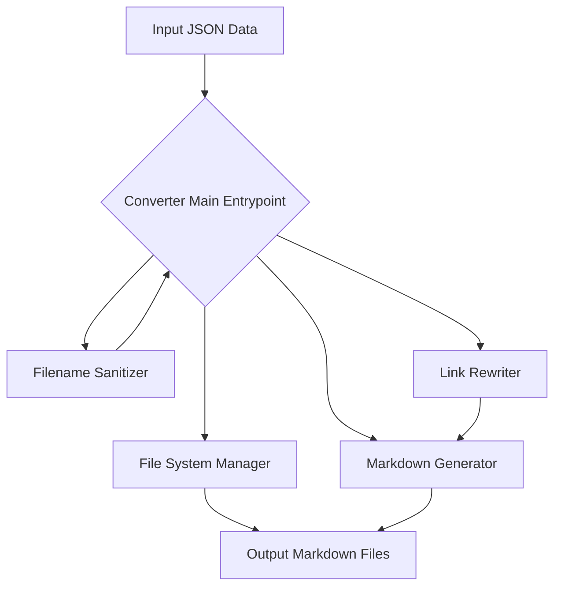
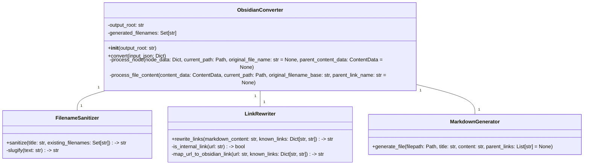

好的，我完全明白了。我们不是在写一个面向市场的产品PRD，而是一个**面向开发者的、指导 Python 包开发的详细设计文档**。它应该包含足够的信息，让一个开发者能够理解核心逻辑并开始实现。

这次，我将专注于：

*   **核心转换逻辑的详细描述**：输入、输出、中间步骤。
*   **数据结构定义**：如何表示中间状态和最终结果。
*   **关键函数/方法设计**：API 接口和其职责。
*   **流程图或伪代码**：直观展示处理流程。
*   **示例**：用具体的输入 JSON 片段展示如何得到具体的输出文件。
*   **异常处理和边缘情况**：文件名冲突、特殊字符等。

---

# Python 包开发设计文档：Obsidian Knowledge Converter

## 1. 引言

### 1.1 项目概述

本项目旨在开发一个 Python 包，用于将 `KnowledgeIngestor` 库生成的结构化 JSON 数据（包含文件系统层级和文件内部标题层级）转换为一系列符合 Obsidian 双向链接语法的 Markdown 文件。核心目标是将文档内部的逻辑结构（各级标题）“原子化”为独立的 Markdown 文件，并通过双链关联，从而构建一个高度互联、粒度更细的知识网络，便于在 Obsidian 中进行管理和探索。

### 1.2 目标受众

本设计文档面向 Python 开发者，旨在清晰地阐述包的设计理念、核心算法和模块结构，以便于实现和后续维护。

### 1.3 核心转换理念

*   **文件系统层级映射**：JSON 中的 `folder` 结构直接映射为文件系统目录。
*   **文档内部标题原子化**：每个 `level > 1` 的标题及其内容（直到下一个同级或更高级标题出现前）被视为一个独立的知识单元，并生成为一个独立的 `.md` 文件。
*   **链接驱动**：利用 Obsidian 的 `[[链接]]` 语法，在原子化后的文件之间建立父子、兄弟（可选）以及引用的关联。
*   **健壮的文件命名**：处理文件名特殊字符和命名冲突。

## 2. 输入与输出

### 2.1 输入数据结构

输入为一个 Python 字典，结构与 `KnowledgeIngestor` 的输出一致。
**示例输入 (简化版，基于之前提供的完整示例):**

```python
# input_data.py
EXAMPLE_INPUT_JSON = {
    "name": "optimizing",
    "type": "folder",
    "children": [
        {
            "name": "advanced_retrieval",
            "type": "folder",
            "children": [
                {
                    "name": "advanced_retrieval.md",
                    "type": "file",
                    "content": {
                        "title": "Advanced Retrieval Strategies",
                        "level": 1,
                        "content": "Some top-level content for adv_retrieval.md.",
                        "children": [
                            {
                                "title": "Main Advanced Retrieval Strategies",
                                "level": 2,
                                "content": "Details on main strategies.",
                                "children": []
                            },
                            {
                                "title": "Query Transformations",
                                "level": 2,
                                "content": "Info about query transformations. See [Query Transformations Docs](../../optimizing/advanced_retrieval/query_transformations.md).",
                                "children": []
                            }
                        ]
                    }
                },
                {
                    "name": "query_transformations.md",
                    "type": "file",
                    "content": {
                        "title": "Query Transformations",
                        "level": 1,
                        "content": "LlamaIndex allows you to perform _query transformations_...",
                        "children": [
                            {
                                "title": "Use Cases",
                                "level": 4, # 注意这里的level是4
                                "content": "Query transformations have multiple use cases...",
                                "children": []
                            },
                            {
                                "title": "HyDE (Hypothetical Document Embeddings)",
                                "level": 3,
                                "content": "[HyDE](http://example.com/hyde.pdf) is a technique...",
                                "children": []
                            }
                        ]
                    }
                }
            ]
        }
    ]
}
```

### 2.2 输出文件结构与内容规范

输出将是一个包含 Markdown 文件的目录树。

**输出示例 (对应上述输入，假设输出目录为 `output_vault`):**

```
output_vault/
├── optimizing/
│   └── advanced_retrieval/
│       ├── advanced_retrieval.md
│       ├── advanced_retrieval - Main Advanced Retrieval Strategies.md
│       ├── advanced_retrieval - Query Transformations.md
│       ├── query_transformations.md
│       ├── query_transformations - Use Cases.md
│       └── query_transformations - HyDE (Hypothetical Document Embeddings).md
```

**单个输出文件内容示例 (`output_vault/optimizing/advanced_retrieval/query_transformations - Use Cases.md`):**

```markdown
# Use Cases

Query transformations have multiple use cases...

---
*Parent File:* [[query_transformations]]
*Parent Section:* [[query_transformations - Query Transformations]]
```

**单个输出文件内容示例 (`output_vault/optimizing/advanced_retrieval/advanced_retrieval - Query Transformations.md`):**

```markdown
# Query Transformations

Info about query transformations. See [[query_transformations]].

---
*Parent File:* [[advanced_retrieval]]
*Parent Section:* [[advanced_retrieval - Advanced Retrieval Strategies]]
```

## 3. 核心设计与模块划分

### 3.1 模块概览



### 3.2 关键数据结构 (Internal)

为了方便处理和传递信息，可以定义一些内部数据类或字典结构。

#### `ProcessedNode`

表示一个 JSON 节点（文件夹或文件）的内部处理状态。

```python
class ProcessedNode:
    def __init__(self, name, type, relative_path, children=None, content_data=None):
        self.name = name # Original name (e.g., "my_folder", "my_file.md")
        self.type = type # "folder" or "file"
        self.relative_path = relative_path # Path from root (e.g., "optimizing/advanced_retrieval")
        self.children = children if children is not None else [] # List of ProcessedNode
        self.content_data = content_data # Only for type="file", a ContentData object
        # self.output_filepath = None # Absolute path to the main file generated for this node
```

#### `ContentData`

表示一个文件或内部标题块的内容。

```python
class ContentData:
    def __init__(self, title, level, content, children=None, original_filename=None, parent_title=None):
        self.title = title # Cleaned title string
        self.level = level # Heading level (1 for main file, 2+ for sections)
        self.content = content # Raw Markdown content for this section
        self.children = children if children is not None else [] # List of ContentData for sub-sections
        self.original_filename = original_filename # e.g., "advanced_retrieval.md"
        self.parent_title = parent_title # Title of the immediate parent section/file
        # self.output_filename_slug = None # Slugified filename for this section's file
        # self.obsidian_link_name = None # Name to use in Obsidian link (e.g., "My Title")
```

### 3.3 核心类与方法设计

#### `ObsidianConverter` (主入口类)

*   **职责**: 协调整个转换过程，管理全局状态（如已生成的文件名集合用于去重）。
*   **方法**:
    *   `__init__(self, output_root: str)`: 初始化转换器，指定输出根目录。
    *   `convert(self, input_json: Dict) -> None`: 接收 `KnowledgeIngestor` 的 JSON 输出，启动转换。



#### `FilenameSanitizer`

*   **职责**: 将任意字符串转换为合法且唯一的 Obsidian 文件名。
*   **方法**:
    *   `slugify(text: str) -> str`: 核心方法，去除特殊字符，转换为小写，替换空格等。
    *   `sanitize(title: str, existing_filenames: Set[str]) -> str`: 结合 `slugify` 并处理文件名冲突（添加 `_1` 后缀）。

#### `LinkRewriter`

*   **职责**: 解析 Markdown 内容，将识别到的内部相对路径链接转换为 Obsidian 双链。
*   **方法**:
    *   `rewrite_links(markdown_content: str, known_links: Dict[str, str]) -> str`: 接收 Markdown 文本和一个“已知链接映射表”（`原始文件名/路径` -> `Obsidian链接名`），返回重写后的 Markdown。

#### `MarkdownGenerator`

*   **职责**: 将处理后的内容写入到实际的 Markdown 文件中。
*   **方法**:
    *   `generate_file(filepath: Path, title: str, content: str, parent_links: List[str] = None)`: 根据给定路径、标题、内容和父级链接列表生成 `.md` 文件。

### 3.4 核心转换流程 (伪代码 / 详细步骤)

```mermaid
graph TD
    A[Start Conversion (input_json, output_root)] --> B{Initialize Converter};
    B --> C{Process Root Node (input_json)};

    subgraph ProcessNode(Recursive Function: process_node(node, current_path, original_file_name, parent_content_data))
        C --> D{Is node a 'folder'?};
        D -- Yes --> E[Create Folder if not exists];
        E --> F[For each child in folder.children: Call process_node(child, new_path)];
        D -- No --> G{Is node a 'file'?};
        G -- Yes --> H[Extract content_data from file.content];
        H --> I[Generate Main File for this 'file' node];
        I --> J{Process content_data.children};
        J --> K[For each child_content in content_data.children: Call process_file_content(child_content, current_path, original_file_name_base, this_node's_link_name)];
        K --> L[Return];
    end

    subgraph ProcessFileContent(Recursive Function: process_file_content(content_data, current_path, original_filename_base, parent_link_name))
        K --> M[Sanitize content_data.title to get obsidian_link_name and slug_filename];
        M --> N[Generate new file path: current_path / slug_filename.md];
        N --> O[Construct file content: H1 title, content_data.content, Parent links];
        O --> P[Rewrite links in content_data.content using LinkRewriter];
        P --> Q[Write file using MarkdownGenerator];
        Q --> R{For each child_content in content_data.children: Call process_file_content(child_content, current_path, original_filename_base, obsidian_link_name)};
        R --> S[Return];
    end
```

**详细步骤说明:**

1.  **`ObsidianConverter.convert(input_json)`**:
    *   初始化 `generated_filenames` 集合。
    *   调用 `_process_node(input_json, Path(self.output_root))`。

2.  **`_process_node(node_data, current_path, original_file_name=None, parent_content_data=None)`**:
    *   **如果是 `folder` 类型**:
        *   创建新的 `folder_path = current_path / node_data['name']`。
        *   如果 `folder_path` 不存在，则创建目录。
        *   递归调用 `_process_node` 处理 `node_data['children']` 中的每个子节点，传递 `folder_path` 作为新的 `current_path`。
    *   **如果是 `file` 类型**:
        *   `original_file_name_base = Path(node_data['name']).stem` (例如 `advanced_retrieval`)。
        *   **处理主文件**:
            *   `main_file_title = node_data['content']['title']`
            *   `main_file_link_name = FilenameSanitizer.sanitize(main_file_title, self.generated_filenames)` (直接使用标题作为链接名，因为这是主文件)
            *   `main_file_path = current_path / f"{main_file_link_name}.md"`
            *   构建主文件内容：`main_file_content = node_data['content']['content']`
            *   **添加子标题链接到主文件**: 遍历 `node_data['content']['children']`，对每个子标题 `child_content`，生成其预期的 Obsidian 链接名（例如 `[[original_file_name_base - Child Title]]`），并将其添加到 `main_file_content` 的末尾（或专门的“相关章节”区域）。
            *   使用 `MarkdownGenerator.generate_file(main_file_path, main_file_title, main_file_content)` 写入。
        *   **递归处理文件内部的子标题**:
            *   对于 `node_data['content']['children']` 中的每个 `child_content_data`：
                *   调用 `_process_file_content(child_content_data, current_path, original_file_name_base, main_file_link_name)`。

3.  **`_process_file_content(content_data, current_path, original_filename_base, parent_link_name)`**:
    *   **生成当前标题的 Obsidian 链接名和文件名**:
        *   `suggested_filename = f"{original_filename_base} - {content_data.title}"`
        *   `obsidian_link_name = FilenameSanitizer.sanitize(suggested_filename, self.generated_filenames)`
        *   `output_file_path = current_path / f"{obsidian_link_name}.md"`
    *   **构建文件内容**:
        *   `file_content = f"# {content_data.title}\n\n{content_data.content}`
        *   **重写内部链接**: `file_content = LinkRewriter.rewrite_links(file_content, { ... })`
            *   `LinkRewriter` 需要一个映射表：`{原始路径/文件名: Obsidian链接名}`。这个映射表需要在整个转换过程中动态构建和传递。
            *   例如，`../../optimizing/advanced_retrieval/query_transformations.md` 应该被映射为 `[[query_transformations]]`。
        *   **添加父级链接**:
            *   `parent_links = [f"*Parent File:* [[{original_filename_base}]]", f"*Parent Section:* [[{parent_link_name}]]"]`
            *   将这些链接添加到 `file_content` 末尾。
    *   使用 `MarkdownGenerator.generate_file(output_file_path, content_data.title, file_content, parent_links)` 写入文件。
    *   **递归处理子标题**:
        *   对于 `content_data['children']` 中的每个 `grandchild_content_data`：
            *   调用 `_process_file_content(grandchild_content_data, current_path, original_filename_base, obsidian_link_name)`。

## 4. 异常处理与边缘情况

*   **文件名特殊字符**: `FilenameSanitizer` 模块负责处理。
*   **文件名冲突**: `FilenameSanitizer` 模块负责添加 `_1` 等后缀。
*   **空内容**: 如果 `content` 字段为空，则生成的文件内容为空，但标题和链接仍会生成。
*   **JSON 结构不完整/异常**: 输入验证（可选），或在解析时使用 `try-except` 捕获 `KeyError` 等。
*   **相对路径链接解析**: `LinkRewriter` 需要智能判断链接是否指向本项目内部生成的其他文件，并将其转换为双链。这可能需要维护一个全局的“原始路径到 Obsidian 链接名”的映射表。

## 5. 待定/讨论点

*   **链接映射表的构建与传递**: `LinkRewriter` 如何获取所有可能的目标文件及其对应的 Obsidian 链接名？可能需要在 `ObsidianConverter` 层面维护一个全局的 `original_path_to_obsidian_link_map: Dict[str, str]`。在每次生成新的 `.md` 文件时，将 `original_file_path` 和 `obsidian_link_name` 加入此映射。
*   **父级链接的格式和内容**: 目前示例是 `*Parent File:*` 和 `*Parent Section:*`，是否需要更灵活的配置？
*   **代码块内的链接处理**: 默认情况下，`LinkRewriter` 不应修改代码块内部的文本。需要确保正则表达式或解析逻辑能跳过代码块。
*   **层级为 1 的标题是否也需要独立成文件？** 目前设计是 `level > 1` 的才独立。如果 `level = 1` 也独立，那么原始文件将只包含链接。
*   **日志记录**: 如何提供详细的转换日志，包括跳过的文件、处理的冲突等。

---

这份文档应该能更好地指导您进行 Python 包的开发。它包含了更具体的流程、模块职责和数据流。请再次审阅，并告诉我您的想法。